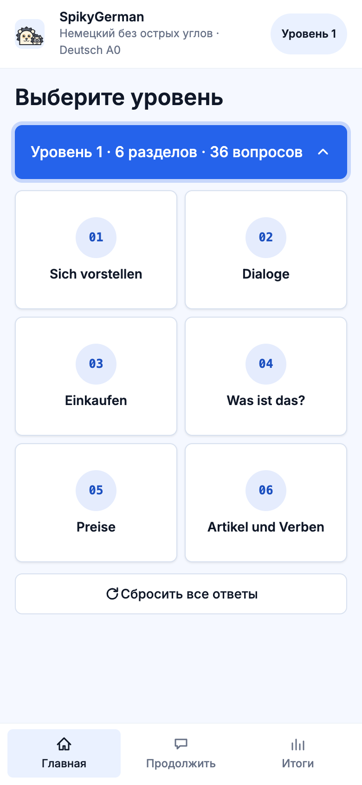
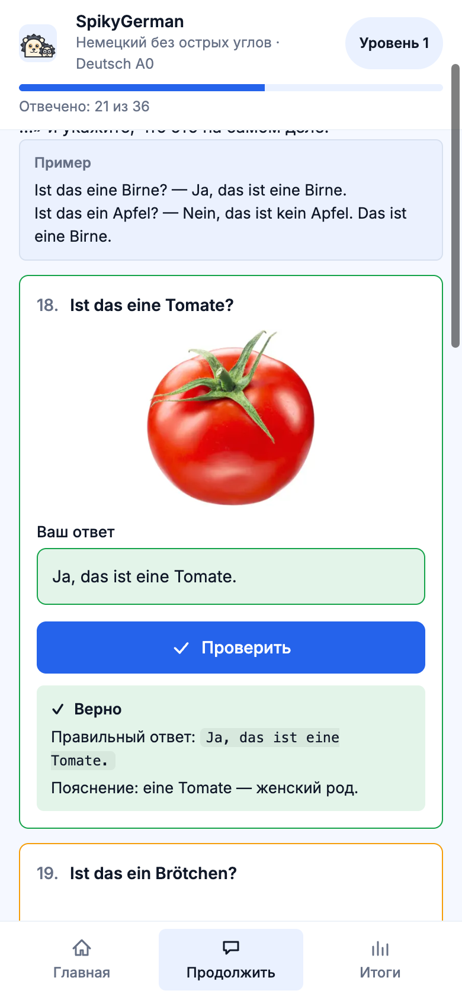
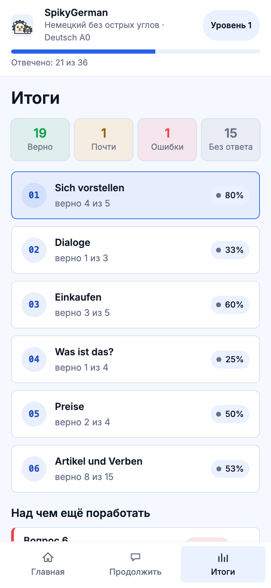

# 🚧 WIP — Work in Progress 🚧

> This project is just getting started. Everything here is subject to change.

# SpikyGerman

*German without the sharp edges.*

A volunteering project teaching refugees the absolute basics of German (level A0),
guided by two hedgehog mascots: **der Igel** (the big one) and **die Igli** (the small, cute one).

## Screenshots

The interface is in Russian in the first MVP; German prompts stay side by side with it.

| Home | A section, mid-test | Summary |
| --- | --- | --- |
|  |  |  |

## Values

- **Multilingual from day one.** Many learners can't read Latin script yet (e.g. Ukrainians
  who only read Cyrillic). The architecture must support translations from the start;
  the first MVP targets **Russian**. Transliteration and click-to-pronounce audio are
  planned for later versions.
- **Accessible — this is a must.** We have blind learners, and our most promising student
  is blind. The site must be fully usable with screen readers.
- **Mobile-first**

## Development

Node.js 24+ (same as CI).

```sh
npm install
npm run dev        # build the content, then start the dev server
npm test           # unit tests
npm run typecheck  # svelte-check
npm run build      # content check + production build
```

## License

[MIT](LICENSE)
